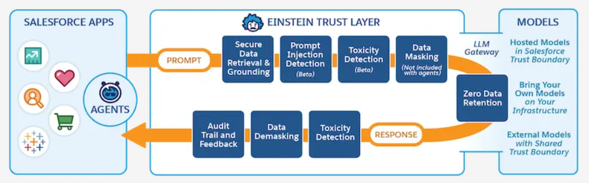

# Salesforce AI Specialist
<!-- Versiones -->
<!-- tabla de versiones -->
| Version | Fecha | Descripción |
| ---     | ---      | ---         |
| 0.1     | 29/04/2024   | Documento de estudio para el examen de Salesforce AI Associate|

## Resources
- [Trailhead](https://trailhead.salesforce.com/en/credentials/ai-specialist)
- [Help](https://help.salesforce.com/s/articleView?id=ai.generative_ai.htm&type=5)
- [Glossary](https://help.salesforce.com/s/articleView?id=ai.copilot_glossary.htm&type=5)
- [Exam Dumps](https://www.apexhours.com/salesforce-certified-ai-specialist-exam-practice-questions/#h-free-salesforce-certified-ai-specialist-exam-practice-questions)

## Introducción
to-do cambiar
El examen de Salesforce Platform Developer I es un examen que evalúa los conocimientos de un desarrollador de Salesforce. En este documento se recogen los conceptos más importantes que se deben conocer para aprobar el examen.

Por una parte los topics son resumenes o transcripciones de la guia de estudio de focus on force y mas adelante hay respuestas concretas a las preguntas test ademas de un banco de preguntas que he hecho yo.

| Concepto  | Descripción |
| ---       | ---         |
| Scoring| 73%         |
| Time    | 70 minutes |
| Questions | 60          |

| Syllabus                           | Weightage |
| ---                                | ---       |
| Einstein Trust Layer                | 15%       |
| Generative AI en Aplicaciones CRM   | 17%       |
| Prompt Builder                      | 37%       |
| Einstein Copilot                    | 23%       |
| Model Builder                       | 8%        |

### Certification Passed Tips

1. **Number of Questions**: The exam has 60 questions, each with three answer options. The pass mark is 73%.
2. **Exam Focus**: The exam is heavily weighted towards the **Prompt Builder**.
3. **Naming Conventions**: Lot of questions about the actual names of solutions.
## Prompt Builder
El Prompt Builder desempeña un papel clave en la personalización de los resultados de la IA. Esta es la sección más ponderada del examen, y se evaluará tu capacidad para usar esta herramienta de manera efectiva. Se evaluará:

- Given business requirements, identify when it’s appropriate to use Prompt Builder.
- Identify the right user roles to manage and execute prompt templates.
- Identify the considerations for creating a prompt template.
- Given a scenario, identify the appropriate grounding technique.
- Explain the process for creating, activating, and executing prompt templates.
  
Other Requirements:
- **Requisitos de Negocio**: Identificar el uso correcto del Prompt Builder según escenarios de negocio específicos, como la creación de respuestas automáticas o contenido personalizado.
- **Roles y Responsabilidades**: Saber qué roles (por ejemplo, administradores, desarrolladores) son responsables de gestionar y ejecutar plantillas de prompts, y cómo asignar estos roles adecuadamente.
- **Creación de Plantillas de Prompts**: Comprensión de las mejores prácticas para crear, activar y ejecutar plantillas de prompts, incluyendo consideraciones como las técnicas correctas de grounding (información contextual para garantizar respuestas precisas de IA).
- **Ejecución de Prompts**: Reconocer los pasos involucrados para garantizar que las plantillas de prompts cumplan con las necesidades empresariales y saber cómo ajustarlas para mejorar su precisión y eficiencia.

1. **Hyperparameters**: Some questions address **Hyperparameters** for models.
2. **Difficulty Level**: The exam is more challenging than the AI Associate certification but slightly easier than the Data Cloud Consultant certification.
3. **Standard Co-Pilot Actions**: Understand the **Standard Co-Pilot Actions** thoroughly.
4. **Groundings**: Know the different types of **Groundings** and their applications.

- Service AI Grounding.
Obtiene conocimiento de los Cases y Knowledge Articles para generar su contenido.

1. **Prompt Templates**: Be familiar with the various **Prompt Templates** and when to use them.
2. **API Questions**: Expect a few questions related to using **REST**, **SOAP**, or **Metadata API**.

### Additional Tips

- Don’t just rely on Trailhead—do as much **hands-on practice** as possible.
- There are lots of **troubleshooting questions**, like "If X doesn’t work, what steps would you recommend?"
- Expect many **scenario-based questions** with 2-3 lines of description (e.g., "Universal Containers wants to…").
- For most questions, you can easily eliminate one incorrect answer. While the passing score is high, this helps balance the difficulty. 
- Some questions have two very close answer options, designed to confuse you—so pay attention!
- **Einstein Trust Layer** and **Sales and Service features** are areas where you can easily score well if you’ve studied the Trailheads properly.

## Einstein Trust Layer  

[Einstein Trust Layer](https://help.salesforce.com/s/articleView?id=ai.generative_ai_trust_layer.htm&language=en_US&type=5)

Einsteins Trust Layer is a set of features and practices that ensure the responsible and ethical use of generative AI within Salesforce. This section evaluates your understanding of:

- **Security Features**: Understanding how Einstein protects data through encryption, access controls, and other security measures.
- **Privacy Compliance**: Knowledge of data privacy laws and how Salesforce complies with regulations like GDPR.
- **Grounding Features**: Implementing AI models in a way that their outputs are reliable and explainable to end-users.
- **Trust Layer Management**: Proficiency in configuring and monitoring the Einstein Trust Layer to ensure data integrity and minimize bias in AI outputs.
- **Data Privacy and Security**: Understanding how Salesforce ensures data privacy and security when using generative AI, including encryption, access controls, and compliance with regulations like GDPR.

**Zero-Data Retention Policy**:

Data is not retained by third party LLMs. Salesforce partners with OpenAI and Azure Open AI to enforce the Zero-Data Retention Policy.
- No data is used for LLM training or product improvement by third-party LLMs.
- No data is retained by third-party LLMs.
- No human being at the third-party LLM provider can access the data.

**Dynamic Grounding with Secured Data Retrieval:**

Qué es Grounding? Dentro del contexto de la IA Generativa, grounding se refiere al proceso de dotar a los modelos de lenguaje de información específica del caso de uso, la cual es relevante pero no está disponible en su conocimiento preexistente.

En salesforce grounding es (Context + Permissions + Data)

- Relevant Data from a Salesforce record is merged with the prompt to provide context.
- Secure data retrieval of Salesforce data for grounding the prompt based on the permissions of the user executing the prompt.
- Secure data retrieval preserves in place all standard Salesforce role-based controls for user permissions and field-level security when merging grounding data from your CRM instance or Data Cloud.

**Prompt Defense**

Que son las hallucinations? 
- System policies help limit hallucinations and decrease the likelihood of unintended or harmful outputs by the LLM.
- System policies can vary for different generative AI features and use cases.

### Prompt Journey

Before Generation:
- Secure Data Retrieval and Grounding
- Prompt Injection Detection
- Toxicity Detection
- Data Masking

LLM Gateway:

After Generation:
Response
- Toxicity Detection
- Data Demasking
- Audit Trail and Feedback

## Generative AI in CRM Applications  
Esta sección se centra en el uso de IA generativa de Salesforce en los contextos de Ventas y Servicios. Las preguntas cubren:

- **Einstein para Ventas**: En escenarios específicos, identificar las características correctas de la IA generativa que optimizan procesos de ventas, como automatización de seguimientos, mejora de respuestas por correo y provisión de insights predictivos.
- **Einstein para Servicios**: Demostrar conocimiento de cómo la IA puede agilizar el servicio al cliente mediante características como resoluciones automatizadas de casos, análisis de sentimiento y sugerencias de respuestas de servicio.

Flex Templates
- Flex Templates are a type of prompt template that allows you to create a custom prompt template with a custom grounding technique on Custom Objects too.

## Einstein Copilot  
El Einstein Copilot permite la automatización y ayuda en acciones en tiempo real dentro de Salesforce. Esta sección evaluará tu conocimiento sobre:

- **Aplicaciones Empresariales**: Identificar cuándo usar Einstein Copilot para automatizar tareas repetitivas y optimizar flujos de trabajo según requisitos empresariales específicos.
- **Capacidades de LLM**: Comprender cómo el Modelo de Lenguaje Extenso (LLM) potencia las acciones del copilot, cómo interpreta los datos empresariales y cómo optimizarlo para resultados específicos.
- **Acciones de Copilot Estándar y Personalizadas**: Demostrar la capacidad de utilizar acciones de copilot predefinidas de manera efectiva, así como crear acciones personalizadas adaptadas a las necesidades únicas del negocio.
- **Adopción del Copilot**: Gestionar y monitorear la adopción del Copilot dentro de una organización, asegurando que los equipos lo utilicen al máximo.

## Model Builder  
Model Builder permite a los usuarios crear y personalizar modelos de IA para casos empresariales específicos. Esta sección cubre:

- **Casos de Uso**: Identificación de escenarios donde el Model Builder es necesario para crear modelos de IA personalizados o ajustar modelos existentes a objetivos organizacionales específicos.
- **Configuración de Modelos**: Demostrar dominio en la configuración de modelos generativos estándar, personalizados y Bring Your Own Large Language Model (BYOLLM) para cumplir con los objetivos empresariales.
- **Requisitos de Negocio**: Comprender cómo alinear los modelos de IA con las estrategias de negocio para optimizar el rendimiento, ya sea mejorando la previsión de ventas, automatizando interacciones con clientes o impulsando campañas de marketing.
