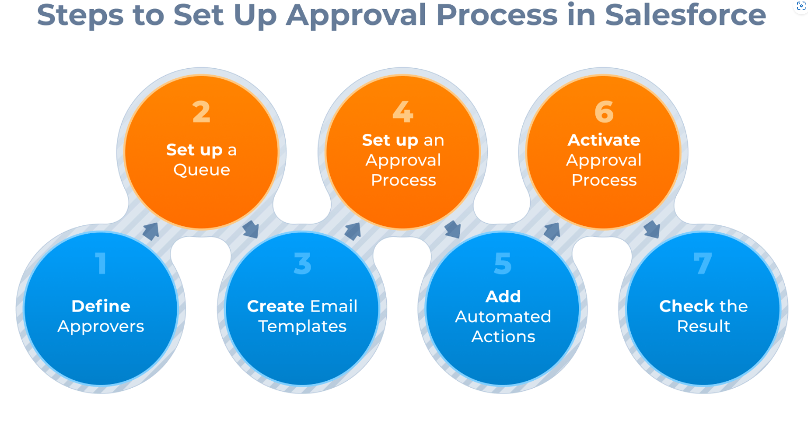
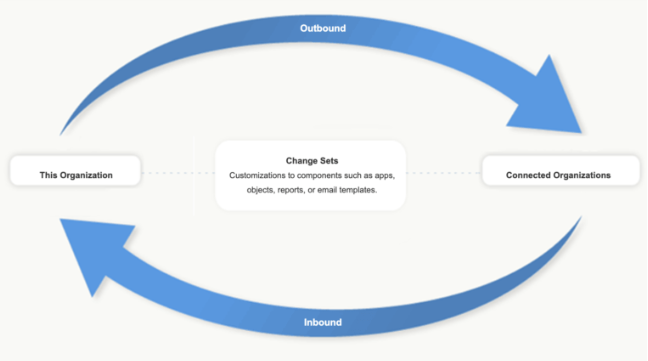

Salesforce App Builder
==============
<!-- Versiones -->
| Version | Fecha       | Descripción                                          |
| ---     | ---         | ---                                                  |
| v0.1     | 24/10/2024  | Start of Document |
| v0.2    | 26/04/2025  | Pre-Exam Revision |

# Introduction

[Study Guide](https://developer.salesforce.com/resources2/certification-site/files/SGCertifiedPlatformAppBuilder.pdf)

El examen de Salesforce Platform App Builder es un examen que evalúa los conocimientos necesarios para construir aplicaciones en la plataforma Salesforce, incluyendo lógica empresarial y automatización de procesos. En este documento se recogen los conceptos más importantes que se deben conocer para aprobar el examen.

Los temas están organizados de acuerdo a la guía oficial de estudio y se incluye un desglose del peso de cada sección del examen.

## Exam Details

- **Scoring:** 63%
- **Time:** 105 minutes
- **Questions:** 60
- **Cost:** USD $200
- **Retake Fee:** USD $100

## Syllabus Percentages

| Syllabus                           | Weighage |
| ---                                | :---       |
| Salesforce Fundamentals                | 23%|
| Business Logic and Process Automation  | 28%     |
| Data Modeling and Management           | 22%     |
| User Interface                         | 17%     |
| App Deployment                         | 10%     |

**Table of Contents**
- [Salesforce App Builder](#salesforce-app-builder)
- [Introduction](#introduction)
  - [Exam Details](#exam-details)
  - [Syllabus Percentages](#syllabus-percentages)
- [Salesforce Fundamentals](#salesforce-fundamentals)
  - [Identify the features and capabilities available when creating reports, report types and dashboards](#identify-the-features-and-capabilities-available-when-creating-reports-report-types-and-dashboards)
  - [Given a set of requirements, determine the appropriate global, object-specific actions and layouts to optimize the Salesforce mobile user experience](#given-a-set-of-requirements-determine-the-appropriate-global-object-specific-actions-and-layouts-to-optimize-the-salesforce-mobile-user-experience)
  - [Identify common scenarios for extending an org using AppExchange apps.](#identify-common-scenarios-for-extending-an-org-using-appexchange-apps)
  - [Apply features and capabilities available to restrict and extend object, record and field access](#apply-features-and-capabilities-available-to-restrict-and-extend-object-record-and-field-access)
  - [Given a set of business requirements, determine the appropriate sharing solution.](#given-a-set-of-business-requirements-determine-the-appropriate-sharing-solution)
  - [Describe the customizations and uses cases for Chatter](#describe-the-customizations-and-uses-cases-for-chatter)
- [Business Logic and Process Automation](#business-logic-and-process-automation)
  - [Given a scenario, determine the capabilities and use cases for workflow, Flows and Process Builder](#given-a-scenario-determine-the-capabilities-and-use-cases-for-workflow-flows-and-process-builder)
    - [Workflow Rules](#workflow-rules)
    - [Flows](#flows)
    - [Process Builder](#process-builder)
  - [Given a scenario, determine the tool or action needed to meet business requirements](#given-a-scenario-determine-the-tool-or-action-needed-to-meet-business-requirements)
  - [Given a scenario, demonstrate the use of formula fields to meet stated business requirements](#given-a-scenario-demonstrate-the-use-of-formula-fields-to-meet-stated-business-requirements)
  - [Given a scenario, determine the capabilities and use cases for approval processes](#given-a-scenario-determine-the-capabilities-and-use-cases-for-approval-processes)
  - [Given a scenario, demonstrate the use of validation rules to meet stated business requirements](#given-a-scenario-demonstrate-the-use-of-validation-rules-to-meet-stated-business-requirements)
  - [Given a set of business requirements, recommend a solution to automate business processes while avoiding errors in automation](#given-a-set-of-business-requirements-recommend-a-solution-to-automate-business-processes-while-avoiding-errors-in-automation)
- [Data Modeling and Management](#data-modeling-and-management)
  - [Explain the capabilities and considerations of the Schema Builder](#explain-the-capabilities-and-considerations-of-the-schema-builder)
  - [Given a scenario, determine the appropriate data model](#given-a-scenario-determine-the-appropriate-data-model)
  - [Given a scenario, determine the considerations when selecting or changing a field data type](#given-a-scenario-determine-the-considerations-when-selecting-or-changing-a-field-data-type)
  - [Given a scenario, determine the options and considerations when importing and exporting data, including the capabilities of external data sources.](#given-a-scenario-determine-the-options-and-considerations-when-importing-and-exporting-data-including-the-capabilities-of-external-data-sources)
  - [Given a scenario, explain the capabilities of the various relationship types and the implications of each on record access, user interface and reporting](#given-a-scenario-explain-the-capabilities-of-the-various-relationship-types-and-the-implications-of-each-on-record-access-user-interface-and-reporting)
- [User Interface](#user-interface)
  - [Describe the user interface customization options.](#describe-the-user-interface-customization-options)
  - [Given a scenario, determine the declarative options available for incorporating Lightning components in an Application](#given-a-scenario-determine-the-declarative-options-available-for-incorporating-lightning-components-in-an-application)
- [App Deployment](#app-deployment)
  - [Given a scenario, determine the appropriate deployment plan](#given-a-scenario-determine-the-appropriate-deployment-plan)
  - [Given a set of business requirements, recommend a solution for key milestones and considerations when managing the application lifecycle and various types of sandboxes](#given-a-set-of-business-requirements-recommend-a-solution-for-key-milestones-and-considerations-when-managing-the-application-lifecycle-and-various-types-of-sandboxes)
  - [Given a use case, demonstrate knowledge, viability and troubleshooting when using change sets](#given-a-use-case-demonstrate-knowledge-viability-and-troubleshooting-when-using-change-sets)
  - [Describe the capabilities and consideration when using change set](#describe-the-capabilities-and-consideration-when-using-change-set)
  - [Describe the uses cases and considerations when using unmanaged and managed packages](#describe-the-uses-cases-and-considerations-when-using-unmanaged-and-managed-packages)

# Salesforce Fundamentals

Salesforce is a cloud-based customer relationship management (CRM) platform that provides a range of tools and services to help businesses manage their customer relationships, sales, marketing, and other business processes.

Decide on:
- when and why to pick an existing Salesforce Solution or search on the AppExchange.
- Which type of Solution to be chosen. Flow or Trigger.

Apex Email Handler

## Identify the features and capabilities available when creating reports, report types and dashboards

First of all you need to understand how all of these elements are stored and shared between users.

All of these elements are stored in folders. Folders are used to organize and manage reports, dashboards, and other components in Salesforce. They can be used to control access to reports and dashboards based on user profiles or roles.
Folders can be shared with users, roles, or public groups to control access to the reports and dashboards within them.

Access levels for folders are as follows:
<!-- view, edit, manage -->
- View: Users can view the reports and dashboards in the folder, but cannot edit or delete them.
- Edit: Users can view and edit the reports and dashboards in the folder, but cannot delete them.
- Manage: Users can view, edit, and delete the reports and dashboards in the folder.

Access can be granted using hierarchies when selecting the Roles and Subordinates option.
<!-- center image-14 -->

  

**Reports**

A report is a list of records that meet specific criteria. Reports can be used to analyze data, track performance, and identify trends in the data.

**Report Types**

Salesforce provides a range of standard report types that can be used to create reports. These report types are based on the objects and fields in Salesforce and can be used to create reports on specific data sets.

When some of the standard report types do not meet the business requirements, custom report types can be created. Custom report types allow you to define the objects and fields that are included in the report and can be used to create reports on specific data sets.

<!-- to-do add image -->

It is important to note that Standard Report Types are not editable. You can only create new custom report types based on them. However custom fields for the Objects included in the report are automatically included in the report type. For example if you create a new field on the Opportunity object, it will be automatically included in the Opportunity with Products report type.

**Dashboards**

A dashboard is a visual representation of data from one or more reports. It can be used to display key performance indicators (KPIs), trends, and other important metrics.

It is composed of different widgets that can be used to display data in different formats, such as charts, graphs, and tables.

These widgets are organized in a grid layout and can be customized to display specific data from the underlying reports. (Minimum size is 1x1)

**Snapshots**
Snapshots are used to capture the state of a report at a specific point in time. This can be useful for tracking changes in data over time or for creating historical reports.

## Given a set of requirements, determine the appropriate global, object-specific actions and layouts to optimize the Salesforce mobile user experience

Mobile Navigation

- Smart Search Items
  
## Identify common scenarios for extending an org using AppExchange apps.

What is AppExchange?

AppExchange is a marketplace for Salesforce applications and components. It allows users to find, install, and customize applications that extend the functionality of Salesforce.

## Apply features and capabilities available to restrict and extend object, record and field access

**Profiles:** Profiles are used to define the permissions and access levels for users in Salesforce. They determine what users can see and do in the system.

Built-in profiles

<!-- define built in profiles the short way with a table-->

| Profile Name         | Description                                                                                   |
| ---                 | ---                                                                                           |
| System Administrator | Full access to all features and settings in Salesforce.                                          |
| Standard User       | Basic access to standard features and settings in Salesforce.                                     |
| Read Only           | Read-only access to all features and settings in Salesforce.                                     |
| Marketing User      | Access to marketing features and settings in Salesforce.                                         |
| API Only            | Access to the Salesforce API only. No access to the Salesforce user interface.                   |

**Permission Sets:** Permission sets are used to grant additional permissions to users beyond what is defined in their profile. They can be used to give users access to specific objects, fields, and records without changing their profile.

A User can get delete access to a record if the user via Profile or permission set.

- Org Access
- Object Access
- Record Access
- Field Access

Organization-wide defaults (OWD) are used to define the default access level for records in Salesforce. They determine who can see and edit records in the system.
- Public Read/Write: All users can see and edit all records.
- Public Read Only: All users can see all records, but only the owner can edit them.
- Private: Only
- Controlled by Parent: The access level is determined by the parent record.
  - This option is only available for master-detail relationships. f.e Case and Account. 
  
**What are scoping rules?**

Scoping rules are used to determine which records are included in a report or dashboard. They can be used to filter records based on specific criteria, such as record type, owner, or date range. todo revisar

## Given a set of business requirements, determine the appropriate sharing solution.

## Describe the customizations and uses cases for Chatter

Chatter is a collaboration tool that allows users to communicate with each other in real time. It is integrated with Salesforce and can be used to share information, files, and updates with other users.

**Features of Chatter:**

- Chatter Groups: Users can create and join groups to collaborate on specific topics or projects.
- Out of Office: Allows users to set their status to out of office and automatically notify other users when they are unavailable.

**Chatter Settings:**
- Allow Users to edit posts and comments.
- Allow Records in Groups: Allows users to share records in Chatter groups and collaborate on them.
  

 
**Permissions for Chatter:**
- Edit my Own Posts: Allows users to edit their own posts in Chatter.

# Business Logic and Process Automation

Salesforce provides a range of tools and features to automate business processes and logic. These tools can be used to create workflows, automate data entry, and integrate with external systems.

## Given a scenario, determine the capabilities and use cases for workflow, Flows and Process Builder
  
### Workflow Rules

Workflow rules are used to automate business processes in Salesforce. They can be used to create tasks, send email alerts, and update fields based on specific criteria.

They are not going to be used for new implementations. They are going to be deprecated in the future.

### Flows
Flow is a powerful tool that allows you to automate business processes in Salesforce. It can be used to create complex workflows, automate data entry, and integrate with external systems.

Variables in Flow etc
- Flow variables are used to store data that can be used in the flow. They can be used to store input data, output data, and intermediate data.

### Process Builder

Process Builder is a powerful tool that allows you to automate business processes in Salesforce. It can be used to create complex workflows, automate data entry, and integrate with external systems.
## Given a scenario, determine the tool or action needed to meet business requirements

Use of prebuilt solutions and its customization

Prebuilt solutions are ready-to-use applications or components that can be installed in Salesforce to extend its functionality. They can be customized to meet specific business requirements.

Example of prebuilt solutions:

Create a Case Flow: There is a prebuilt solution that allows users to create a case in Salesforce using a **Screen Flow**. This can be used to automate the process of creating cases and reduce the time it takes to create them.

In case the prebuilt solution does not meet the business requirements, it can be customized using the Flow Builder to add Screen Elements, Decision Elements, and other components to the flow.

**Email Notification**

Email notifications can be sent with Flow Actions. These notifications can be used to notify users of important events or changes in the system.
d 
## Given a scenario, demonstrate the use of formula fields to meet stated business requirements

What is a formula field?

- A formula field is a read-only field that derives its value from a formula expression. The formula expression can include merge fields, operators, and functions.

What field types can be used in formula fields?
- Text
- Number
- Currency
- Date
- etc
What fields cannot be used in formula fields?
- Formula fields cannot be used in formula fields.
- Text Area fields cannot be used in formula fields.
- Rich Text Area fields cannot be used in formula fields.
- Long Text Area fields cannot be used in formula fields.
  
## Given a scenario, determine the capabilities and use cases for approval processes

Approval Process

What is an approval process?
- Automated process for approving records in Salesforce
- Number of approvers can be defined in the process
  
Who can edit a record while submitted for approval?
- The System Administrator can edit a record while it is submitted for approval. Also the approver can edit the record while it is submitted for approval.

- Define the steps necessary for a record to be approved

What can an Approval Process do when a record is approved?

- Send an email notification to the approver and the record owner
- Update the record with the approval status
- Create a task for the approver
- Send an outbound message to an external system

How is the approval request triggered?

- By having a User click on a button or Link
- By submitting the request using a Process
- By submitting the request using a Flow
  - Submit for Approval core action in Flow
- By submitting the request using Apex
  - Programattically using ProcessRequest and ProcessResult classes

## Given a scenario, demonstrate the use of validation rules to meet stated business requirements

What is a validation rule?

A validation rule is a rule that verifies that the data entered in a record meets the specified criteria before the record can be saved.

Validation Rules Tips 

<!-- Functions table html -->

- REGEX(): 
  - Regular expression function that can be used to validate the format of a field. For example, it can be used to validate the format of an email address or phone number.
  - REGEX()
- ISBLANK(): 
  - Function that checks if a field is blank or empty. It can be used to validate that a field is required and must be filled out before the record can be saved.
- ISCHANGED():
  - Function that checks if a field has been changed. It can be used to validate that a field is required only when it has been changed.
- ISPICKVAL():
  - Function that checks if a picklist field has a specific value. It can be used to validate that a field is required only when the picklist field has a specific value.
- ISNEW(): 
  - Function that checks if a record is new or has been changed. It can be used to validate that a field is required only for new records or only for changed records.

## Given a set of business requirements, recommend a solution to automate business processes while avoiding errors in automation

**Queues and Approval Processes**

- Queues are used to manage and assign records to groups of users. They can be used to assign records to a specific group of users based on specific criteria, such as record type or owner.
- Approval processes are used to automate the approval of records in Salesforce. They can be used to define the steps necessary for a record to be approved, including the approvers and the criteria for approval.

# Data Modeling and Management

Data Modeling and Management is the process of designing and managing the data structures and relationships in Salesforce. It includes creating custom objects, fields, and relationships, as well as managing data integrity and security.
## Explain the capabilities and considerations of the Schema Builder

Schema Builder is a tool that allows you to visualize and manage the data model in Salesforce. It provides a graphical representation of the objects, fields, and relationships in the system.

When creating a field in Schema Builder it wont be added automatically to the page layout. You need to add it manually.

## Given a scenario, determine the appropriate data model

**Person Accounts**

Person Accounts are a special type of account in Salesforce that are used to represent individual consumers or customers. They are used to manage data for individuals rather than businesses or organizations.

Specifics of Person Accounts:

- Person Account cannot have hierarchical structure.
- This feature cannot be disabled once enabled.

**Junction Object**

A junction object is a custom object that is used to create a many-to-many relationship between two objects. It is used to link two objects together and allow them to share data.

Case Scenario for a Junction Object:

Job Position and Candidate

- A Job Position can have many Candidates 
- A Candidate can apply for many Job Positions
- An intermediate object is needed to create a many-to-many relationship between Job Position and Candidate. This intermediate object is called a junction object. In this case a Job Application object can be created to store the relationship between Job Position and Candidate.
  

Case Scenario for an Object + Lookup Relationship over a Picklist:

Global Containers want to track the location of each container.

Advantages of using a Lookup Relationship over a Picklist:
- Additional information about the container can be stored in a custom object called Container Location.
- Larger number of locations can be added to the system without modifying the picklist values.
- User can add new locations without modifying the picklist values.
  

## Given a scenario, determine the considerations when selecting or changing a field data type

All Types of fields:

Case Picklist to Multipicklist
values retain

How text(encrypted) fields are stored in the database? work

- Encrypted text fields are stored in the database as encrypted values. The original value is not stored in the database, only the encrypted value is stored. 
- Mask can be applied to the field to hide the original value. The mask is applied when the field is displayed in the user interface. The original value is not displayed in the user interface, only the masked value is displayed.

## Given a scenario, determine the options and considerations when importing and exporting data, including the capabilities of external data sources.

Data Importing and Exporting Tools

- Data Import Wizard
  - Limited to 50,000 records
- Data Loader
- Workbench
- Apex Data Loader

| Tool                | Data Import Wizard | Data Loader | Workbench | Apex Data Loader |
| ---                 | ---                | ---         | ---       | ---              |
| Maximum Records     | 50,000             | 5 Million   | 5 Million | 5 Million        |
| File Formats        | CSV                | CSV         | CSV       | CSV              |
| Object Types       | Standard and Custom| Standard and Custom | Standard and Custom | Standard and Custom |
| Bulk API           | No                 | Yes         | Yes       | Yes              |

How to insert records from an external system into Salesforce with unique identifiers?
- External IDs can be used to insert records from an external system into Salesforce. External IDs are unique identifiers that are used to match records in Salesforce with records in the external system.
  
Case Scenario for External IDs:
SAP system has a unique identifier for each record. This identifier can be used as an external ID in Salesforce to match records in Salesforce with records in the SAP system.

We define the SAP Id as an external ID in Salesforce on the Account object for example. When we import records from the SAP system into Salesforce, we can use the SAP Id as an external ID to match records in Salesforce with records in the SAP system.

What happens when you try to import a file with values that are not in a restricted picklist?
- The import will fail and the values will not be imported into the system. Errors will be generated for each record that contains a value not in the restricted picklist.

**Setting**

**Error**

## Given a scenario, explain the capabilities of the various relationship types and the implications of each on record access, user interface and reporting

What is a relationship in Salesforce?
- A relationship is a link between two objects that allows you to associate records in one object with records in another object.

**Master Detail**

A master-detail relationship is a type of relationship in Salesforce that allows you to create a parent-child relationship between two objects. In a master-detail relationship, the detail record is dependent on the master record. This means that if the master record is deleted, all detail records associated with it are also deleted.

- Roll-up summary fields can be created on the master record to summarize data from the detail records.
- No more than 2 MD relationships to the same object
- Ownership of the detail record is determined by the master record

Child records in master-detail on custom objects can be reparented to different parent records by selecting the Allow Reparenting checkbox on the master-detail relationship definition.

**Lookup**

A lookup relationship is a type of relationship in Salesforce that allows you to create a link between two objects. In a lookup relationship, the child record is not dependent on the parent record. This means that if the parent record is deleted, the child record is not deleted.
Limitations

- No Roll-up summary fields

**Hierarchical**

A hierarchical relationship is a type of relationship in Salesforce that allows you to create a link between two objects. In a hierarchical relationship, the child record is dependent on the parent record. This means that if the parent record is deleted, the child record is also deleted.

- Hierarchical relationships are only available on the User object. They allow you to create a hierarchy of users in Salesforce.

**Indirect Lookup**

todo

# User Interface

## Describe the user interface customization options.

**Layouts**

Layouts are a way to customize the user interface in Salesforce. They allow you to define the layout and organization of fields, sections, and related lists on a record page.

There are different types of layouts in Salesforce:
- Page Layouts: Page layouts are used to define the layout and organization of fields, sections, and related lists on a record page. They can be used to customize the user interface for different profiles or record types.
- Compact Layouts: Compact layouts are used to define the layout and organization of fields on a record page in the Salesforce mobile app. They can be used to customize the user interface for different profiles or record types.
- Search Layouts: Search layouts are used to define the layout and organization of fields on a search results page. They can be used to customize the user interface for different profiles or record types.

On Lightning App Builder you can customize and create the following:
- Lightning Pages
- Record Pages
- Home Pages
- App Pages

Fields can be arranged in either 1 or 2 columns in Lightning App Builder.

Middle Name and Suffix fields can be disabled on User Interface -> Name Settings

**Field Properties**

On a Page Layout you can set the following properties for a field:
- Required: The field is required and must be filled out before the record can be saved.
- Read-Only: The field is read-only and cannot be edited by the user.

Note that the field properties set on a page layout do not affect the field properties set on the field itself. For example, if a field is set to Read-Only on the field itself, it will take values from API or other sources, even if it is set to Editable on the page layout.

To set a field to Read-Only on the page layout, you need to set the field-level security settings for the field.

**Use of Dynamic Related List**
- Dynamic related lists are used to display related records in a list format. They can be used to display related records based on specific criteria, such as record type or owner.

This kind of related list provide persistence of filters and sorting when navigating between records and sessions.

## Given a scenario, determine the declarative options available for incorporating Lightning components in an Application

What is a Lightning component?

A Lightning component is a reusable building block for creating user interfaces in Salesforce. Lightning components can be used to create custom pages, apps, and components in Salesforce.

When added you can set the input properties and attributes easily in the Lightning App Builder.

These can be added to the following:
- Lightning App Page
- Lightning Experience Home Page
- Lightning Experience Record Page

You can add Standard Components and Global Actions

**Dynamic Actions**

Dynamic actions are used to display or hide actions on a record page based on specific criteria. They can be used to customize the user interface for different profiles or record types.

# App Deployment

This topic relies on how to maintain your application up to date between different environments.

App Deployment is the process of moving customizations and configurations from one Salesforce org to another. This can include moving custom objects, fields, page layouts, and other components.

## Given a scenario, determine the appropriate deployment plan

**Product Deployment Plan Steps:**

  - Announce Maintenance Window
- Validate Change Sets
- Lock Out Users
- Deploy Change Sets
- Perform Post-Deployment Steps (Manually)
- Verify Functional Changes
- Unlock Users

Steps may vary depending on the type of deployment and the components being deployed.

What is Staging

## Given a set of business requirements, recommend a solution for key milestones and considerations when managing the application lifecycle and various types of sandboxes

**Sandboxes types**

- Developer Sandbox: A sandbox that is used for development and testing. It contains a copy of the production org's metadata but does not contain any production data.
- Developer Pro Sandbox: A sandbox that is used for development and testing. It contains a copy of the production org's metadata and a larger storage capacity than a Developer Sandbox.
- Partial Copy Sandbox: A sandbox that is used for testing and training. It contains a copy of the production org's metadata and a subset of production data.
- Full Sandbox: A sandbox that is used for testing and training. It contains a complete copy of the production org's metadata and production data.

Table of Sandbox Types

| Sandbox Type        | Description                                                                                   | Storage Limitations |
| ---                 | ---                                                                                           | ---                 |
| Developer Sandbox   | A sandbox that is used for development and testing. It contains a copy of the production org's metadata but does not contain any production data. | 200 MB              |
| Developer Pro Sandbox | A sandbox that is used for development and testing. It contains a copy of the production org's metadata and a larger storage capacity than a Developer Sandbox. | 1 GB                |
| Partial Copy Sandbox | A sandbox that is used for testing and training. It contains a copy of the production org's metadata and a subset of production data. | 5 GB                |
| Full Sandbox        | A sandbox that is used for testing and training. It contains a complete copy of the production org's metadata and production data. | 100% of production data |

**Sandbox Refreshing**

Sandboxes can be refreshed to update the metadata and data in the sandbox. This can be done by going to Setup -> Sandboxes and clicking on the Refresh link for the sandbox you want to refresh.

Users in the Sandbox organization will adopt the same permissions as in the production organization. Also his new usernames will be the same as in production but with a suffix added to the username. For example, if the production username is john.doe@salesforce.com the sandbox username will be john.doe@salesforce.com.sandboxname.

- Interval
Integration testing step -> Define

- Integration testing is the process of testing the interaction between different components of a system to ensure that they work together as expected. It is typically done after unit testing and before system testing.

Release Environments:

1. **Develop and Test**: Each of the members own Developer Sandbox to create their assigned customization. Developer Sandbox contain no production data.
2. **Build Release**: Each member migrates their customization from their DevSandboxes to a common DevProSandbox for integration. DPS do not contain production data but you can seed them with testing data.
3. **Test Release**: For UAT, the team uses a partial copy sandbox to create a complete replica of production (without production Data)
4. **Release**: After the release is in production, the team can use the full sandbox to train users without the risk of altering production data. A full sandbox includes a copy of production data.

**Logging on to Sandbox environments**

You can log in to a sandbox environment from the production environment by going to Setup -> Sandboxes and clicking on the login link for the sandbox you want to log in to.

You can also log in to a sandbox environment by going to the sandbox URL and entering your production username and password.

Sandbox Templates

- Sandbox templates are used to define the data that is included in a sandbox when it is created. They can be used to include or exclude specific objects, fields, and records from the sandbox.
## Given a use case, demonstrate knowledge, viability and troubleshooting when using change sets

**What is a Change Set?**

- A change set is a container for components that you want to deploy from one Salesforce org to another. Change sets are used to move customizations between related orgs, such as from a sandbox to a production org.
- When a change set fails the entire transaction is rolled back
- Cannot be rolled back once deployed
- Validation is not required but recommended
- Can go from sandbox to production or production to sandbox
  - But they need to be affiliated with the same production org
  
**Inbound and Outbound**
- Inbound change set: A change set that is received by an org. Inbound change sets are used to deploy components from a source org to a target org.
- Outbound change set: A change set that is sent from an org. Outbound change sets are used to deploy components from a target org to a source org.

**Best Practices for change sets**

1. Deploy all dependent components
2. Add permissions and access settings to outbound change set
3. Clone a change set to add dependent components to an uploaded change set
4. Use distinct names for global publisher layouts and Outlook publisher layouts
5. Plan deployments around maintenance schedule
6. Validate change sets before deployment
7. View component details

## Describe the capabilities and consideration when using change set

- Quick deploy is a feature that allows you to deploy a change set without running all tests. This can be useful when you want to deploy a change set quickly and do not want to wait for all tests to run.

## Describe the uses cases and considerations when using unmanaged and managed packages

  

What is a package on Salesforce?
- A package is a container for components that can be distributed and installed in other Salesforce orgs. Packages can include custom objects, Apex code, Visualforce pages, and other components.

 
Unmanaged Package

- Unmanaged packages are used to distribute open-source projects or applications that are not intended to be upgraded. Unmanaged packages do not include a namespace and can be modified by the recipient org. Once the components are installed in the recipient org, they are no longer associated with the original package and cannot be edited. The developer of the unmanaged package does not have control over the components in the recipient org.
  
Managed Package

- Managed packages are used to distribute commercial applications that are intended to be upgraded. Managed packages include a namespace and can be modified by the recipient org. The developer of the managed package has control over the components in the recipient org and can upgrade the package. Managed packages can also include a license agreement and can be sold on the AppExchange.

**Naming conflicts**

- Unmanaged packages do not include a namespace and can cause naming conflicts with other components in the recipient org. Managed packages include a namespace and do not cause naming conflicts with other components in the recipient org.

