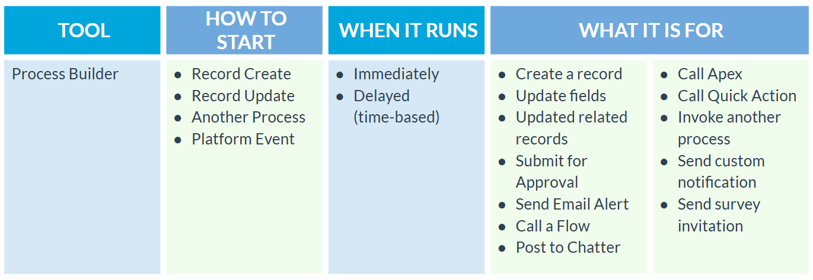
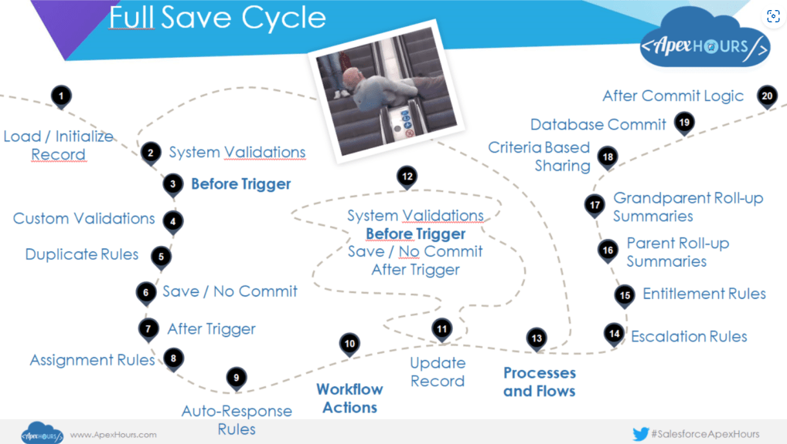

# Salesforce Platform Developer I
<!-- Versiones -->
<!-- tabla de versiones -->
| Version | Fecha | Descripción |
| ---     | ---      | ---         |
| 0.1     | 29/04/2024   | Documento de estudio para el examen de Salesforce Platform Developer I (Sin organizar)|
| 0.2     | 29/04/2024   |Organizado y añadido cosas de Examenes FoF|
| 0.3     | 16/09/2024   |Añadida la guía de estudio.|
| 0.4     | 23/09/2024   |Terminado Dev Fundamentals Topic I.|

## Status estudio

<!-- TABLA -->
| Tema | Porcentaje |
| ---  | ---        |
| User Interface | 53% |
| Developer Fundamentals | 64.29% |
| Testing, Debugging, and Deployment | 76.92% |
| Process Automation and Logic | 88.89% |

## Introducción
El examen de Salesforce Platform Developer I es un examen que evalúa los conocimientos de un desarrollador de Salesforce. En este documento se recogen los conceptos más importantes que se deben conocer para aprobar el examen.

Por una parte los topics son resumenes o transcripciones de la guia de estudio de focus on force y mas adelante hay respuestas concretas a las preguntas test ademas de un banco de preguntas que he hecho yo.

| Concepto  | Descripción |
| ---       | ---         |
| Puntuación| 68%         |
| Tiempo    | 105 minutos |
| Preguntas | 60          |

| Syllabus                          | Weightage |
| ---                               | ---       |
|Developer Fundamentals	            |23%        |
|Process Automation and Logic       |30%        |
|User Interface	                    |25%        |
|Testing, Debugging, and Deployment |22%        |

## Indice 

- Dev Fundamentals
- Process Automation and Logic ( Declarative, Apex, Advanced)
- User Interface
- Testing, Debugging and Deployment


## Developer Fundamentals

### Understande Multi-tenant concepts and design frameworks, such as MVC arquitecture and Lightning Component Framework
Introduction

Salesforce is built upon a multi-tenant architecture and consists of features and characteristics such as cloud computing, shared system resources,automatic system updates, and metadata-driven kernel. In effect, development in this environment impose different considerations compared to traditional development.

Salesforce generally follows the Model-View-Controller (MVC) architecture where each layer presents specific aspects pertaining to application development.

Solutions can be developed in the platform using several built-in declarative tools. For more complex requirements, programmatic tools are available such as Apex and Visualforce. The Lightning Component framework, which is a UI framework, can be used for building custom Lightning components to deliver responsive and efficient event-driven applications.


Salesforce Multitenant Architecture consist of the following key elements and features:


#### Cloud Computing

Lighthning platforms is a PaaS that is bult for cloud computing and based on the multitenant architecture.

1. Web Based Platform

Resources are accesed via Internet using a browser

2. Focused Development

Underlying IT mechanism do not need to b

3. Developer Console

An Integrated DevelopmentEnvironment (IDE) may be used

4. No software installation

No client software is required for access and development

#### Shared Resources
1. All Customers share the same computing power, custom-designed database, data storage and core features.
2. Salesforce monitors code execution and has various governor and resource limits associated with code execution
3. Resources such as CPU Usage, queries and records returned are limited per customer to ensure optimal performance.

#### System Updates
- System Updates

Automatic Seamless Upgrades are rolled out three times a Year Spring,Summer and Winter
- Shared Environment

All customers automatically get the same updates at the same time throughout the year

- Release Preview

Sandboxes are upgraded before production so that the changes can be previewed and tested.

#### Metadata Driven Kernel

Arch: There is a clear separation between the runtime database engine(kernel), tenant data and metadata, which allows easy upgrades.

Deployment: Deployment of new or updated metadata components to production is strictly managed. Unit tests must cover 75% of the application's source code for deployment to production.

#### Governor Limits

Governor limits ensures tenants do not monopolize shared resources. If exceeded, these limits throw exceptions that cannot be handled and should always be taken in account during developing.


MVC Architecture

In application development, the MVC is an architectural pattern that separates the data layer from thebusiness logic and how the data is presented in the user interface.

❖CONTROLLER represents the business logic, either declarative or programmatic. Custom controllers and controller extensions are written as Apex classes.

It includes the following Components:

- Standard Objects
- Custom Objects
- Object Fields
- Object Relationships
- Apex Classes (Data)

❖VIEW represents the presentation layer which consists of pages and components.

It includes the following Components:

- Standard Pages
- Visualforce Pages
- Visualforce Components
- Custom Tabs
- Page Layouts

❖MODEL represents the structure of the data through sObjects, fields, and Apex classes.

It includes the following Components:

- Standard Controllers
- Custom Controllers (Apex)
- Extensions (Apex)
- Declarative Rules & Tools (Apex Triggers, Validation Rules, Flows, etc.).

#### Lightning Component Framework

A UI framework that allows building SPAs with dynamic and responsive User Interfaces in Salesforce.
- JavaScript on client side
- Apex in server side

There are 2 programming language models: Aura components and LWC. They both can coexist and interoperate on a page.

Benefits:
- Device awareness
- Cross Browser Compatibility
- Out of the box components
- Customizing Lightning Experience

About Performance it utilizes Stateful Client using JS and stateless server (Apex) The client call the server only when absolutely necessary, which results in fewer calls to the server and more responsive and efficient apps.

Lightning components utilize Event-driven arch. Components are capable of listening to events and responding accordingly.

The USAGE may vary for different Contexts. For example they can be added as custom tabs in lightning Experience and the Salesforce Mobile App.

The Lightning Component Framework is not strictly based on the MVC architecture. Aura and Lightning web components follow the MVCC (Model-View-Controller-Controller) pattern.

- MODEL represents the database (sObjects,fields, and Apex classes).
- VIEW represents the Lightning component. Ithas the .cmp suffix and contains markup. The markup contains text and/or references to other components.
- CONTROLLER (SERVER-SIDE) The Apex controller on the server side is used to perform database operations. The JavaScript controller is used to call methods in the Apex controller.
- CONTROLLER (CLIENT-SIDE) The JavaScript controller on the client side is used to perform client-side operations and also acts as the intermediary between the server and the UI.


#### App Manager Page 24

An app is a group of tabs that work as a unit. In Salesforce both Lightning and Classic apps can be created and customized to serve specific functions in Salesforce.

- App Contents

Classic Apps contain standard and custom tabs, which can include standard and custom object tabs, Visualforce tabs, Lightning component tabs, Canvas apps and web apps. On the other hand, Lightning apps contain everything from the Classic apps list, plus they can contain Lightning Page tabs and utilities like Sales Dialer.

- Creating Apps

A Lightning App can be created by navigating to App Manager in Setup. Once an app is created, it can be extended by adding objects and fields, using automation, defining Access Settings, adding Users, etc... Lightning App Builder can be used to update the app branding, navigation, and other options, and manage the Lightning pages assigned to the app.

- New Lightning App Wizard

When creating a new Lightning app using the App Manager, the app can be given a name, its primary color and logo can be set, app description can be added, and the type of navigation (standard or console) can be set. Form factors available for the app can be selected. The items that appear in the navigation bar can be selected. Utility items, like Recent Items, Notes, Dialer, To do list, and Open CTI, can be added to the utility bar. The app can be assigned to user profiles.

Creating an App

When creating a new Lightning App, the App Name and Developer Name are required. Other details such as its description and branding can also be specified.


In the App Options configuration page, the navigation style and form factors that the app will support are specified. Other options are related to setup and personalization settings.


In the App Options configuration page, the navigation styleand form factorsthat the app will support are specified. 


The navigation style determines the personalization settings available for the App


Utility Items can be added to a utility bar, which is a feature that is only available to desktop devices.


The items that are added to the Selected Itemscolumn will appear in the navigation bar of the Lightning App.


The Navigation Rules option, which is only available when using the Console navigation style, determines whether records are opened as a workspace tab or subtab of another record.


Profiles are assigned to the Lightning App by adding them to the Selected Profilescolumn. Only users assigned to these profiles will be able to access the Lightning App.


❖NAVIGATION BAR

The item at the top of the list in the navigation bar becomes the app’s landing page on both desktop and mobile. The order of the items determines the default objects shown in the Top Results page on the search results page.

LIGHTNING APP BUILDER

Lightning App Builder is a declarative tool that can be utilized to create and configure custom pages for Lightning Experience and the Salesforce mobile app.

- CAPABILITIES Lightning App Builder allows building and customizing single-page apps, dashboard-style apps, ‘point’ apps that solve a particular task, customrecord pages, custom Home pages, and custom email application panes.
- PAGE TYPES The following Lightning page types are available: apppage, homepage, recordpage, emailapplicationpane, forecasts page,  and Omni Supervisorpage. Note that some of these page types require additional configuration in order to appear as an option in Lightning App Builder. After specifying the page type to use, a template is selected that determines the layout and number of regions in the Lightning page.
- CREATING A LIGHTNING PAGE To define the content of a Lightning page, standard, customand third-party Lightning components from the AppExchange can be added to the Lightning page.
- STANDARD LIGHTNING COMPONENTS everal standard Lightning components built by Salesforce are available for creating Lightning pages. Some of them have required properties that must be configured. Examples include Accordion, Chatter, RecordDetail, RelatedRecord, etc.
- CUSTOM LIGHTNING COMPONENTSCustom Lightning components can be built and added to a Lightning page. However, to make a custom Lightning component usable in the Lightning App Builder and Lightning pages, the component and its component bundlemust be configured so that they are compatible. My Domain must also be deployed in the org.
- DYNAMIC LIGHTNING PAGESIt is possible to configure when a component appears on a Lightning page by adding filter conditions and logic to its properties in the Lightning App Builder. For example, a Lightning component can be set to display exclusively when its page is viewed on a phone.

Lightning App Builder can be used to build Lightning pages for using Standard, Custom and Third-party Lightning components.


#### Declarative Tools

Salesforce provides various declarative tools that can be used to build and extend apps.

**AUTOMATION**

Included tools for automating business processes:
- Flow Builder
- Process Builder
- Approval Process
- Workflow Rule


##### AUTOMATION

Declarative automation tools can implement simple or complex processes.

PROCESS BUILDER

**Process Builder** performs immediate or time-based actionswhen a record is created, a record is updated, or a platformevent occurs. It is capable of performing actions conditionallybased on a single or multiple if/then statements.

Process Builder supports the following operations:
1. Creating new records
2. Updating any related record
3. Invoking Apex code
4. Creating a Chatter post
5. Sending an email alert
6. Submitting a record for approval
7. Launching a flow or another process
8. Sending a custom notification

FLOW BUILDER

**Flow Builder** can be used to automate a guided visual experience or start a business process from a User Interaction, process, schedule, platform Event or record changes. Flows can also be invoked trough Apex and vice-versa.

Flows can be used, for example, in the following:
1. Creating new records
2. Deleting records
3. Launching another flow
4. Updating any record
5. Sending an email alert
6. Sending a custom notification
7. Invoking Apex code
8. Submitting a record for approval
9. Creating a Chatter post
10. Sending an outbound message

APPROVAL PROCESS

An **approval process** can be used to submit a record for approval when a user clicks a button or link or when a flow or process submits a record for approval.
1. Creating new tasks
2. Sending an email alert
3. Updating the original record or its parent
4. Sending an outbound message

WORKFLOW RULE

A **Workflow rule** can be used to implement a business process that consists of a single if/then statement. It can be triggered when a record is created or updated, and supports both immediate and time-based actions.

1. Creating new tasks
2. Sending an email alert
3. Updating the original record or its parent
4. Sending an outbound message


TABLA COMPARATIVA

| Acción                              | Process Builder | Flow Builder | Approval Process | Workflow Rule |
|--------------------------------------|-----------------|--------------|------------------|---------------|
| Crear nuevos registros               | ✓               | ✓            | ✗                | ✗             |
| Eliminar registros                   | ✗               | ✓            | ✗                | ✗             |
| Actualizar registros                 | ✓ (relacionados) | ✓ (cualquier) | ✓ (original o padre) | ✓ (original o padre) |
| Invocar código Apex                  | ✓               | ✓            | ✗                | ✗             |
| Crear publicación en Chatter         | ✓               | ✓            | ✗                | ✗             |
| Enviar alerta de correo              | ✓               | ✓            | ✓                | ✓             |
| Enviar una notificación personalizada | ✓               | ✓            | ✗                | ✗             |
| Enviar mensaje saliente              | ✗               | ✓            | ✓                | ✓             |
| Lanzar flujo u otro proceso          | ✓               | ✓            | ✗                | ✗             |
| Enviar registro para aprobación      | ✓               | ✓            | ✗ (inicia proceso) | ✗             |
| Crear nuevas tareas                  | ✗               | ✗            | ✓                | ✓             |

##### SHARING AND SECURITY

Features such as profiles, permission sets and org-wide defaults can be used to control sharing and security.

Sharing and security features can be utilized to expose different data sets to different sets of users in Salesforce.

❖PROFILES & PERMISSION SETS Profiles and permission sets can be used to specify the objects and fieldsthat users can access as well as user permissions that control what tasks users can perform and what features they can access.

❖RECORD ACCESS Access to records can be controlled by specifying organization-wide default sharing settings. Additional access to records can be provided using features such as sharing rules, role hierarchy, manual sharing, and teams.


##### BUSINESS LOGIC AND VALIDATION

**Formula fields** and **Roll-up summary fields** can be used to calculate field values. **Validation rules** can be used to enforce data quality

Declarative features can be used to automate the calculation and validation of field values.

FORMULA FIELDS 

A formula field can be used to automatically calculate the value of a field based on other fields, expressions, or values. A data type can be selected while building a formula field. The formula specified in the field can contain references to the values of fields, operators, functions, literal values, or other formulas.

ROLL-UP SUMMARY FIELDS

A roll-up summary field is used to automatically calculate the value of a field on a parent record based on the values of a field on child records. For example, the sum of the values of a custom field named ‘Amount__c’ on child records can be displayed on the parent record.

VALIDATION RULES

A validation rule can be used to verify that the data entered by a user on a record meets the standards before the record is saved.

##### USER INTERFACE

There are various tools available to create UI such as **App Manager**, **Lightning App Builder** and **Quick Actions**.

APP MANAGER

App Manager can be used to create an app which acts as the container for a set of items such as object tabs and utility items.

LIGHTNING APP BUILDER

Lightning App Builder can be used for building and customizing single-page apps, dashboard-style apps, ‘point’ apps that solve a particular task, custom record pages, custom Home pages, and custom email application panes.

QUICK ACTIONS
Object-specific and global quick actions can be created to allow users to invoke custom functionality when using the UI. For example, they can use a quick action to quickly send an email to a customer.


##### DATA MANAGEMENT

**Data Import Wizard** and **Data Loader** can be used to insert and update multiple records. Data Loader can also be used to export and delete records.

DATA IMPORT WIZARD

Data Import Wizard supports import up to 50,000 records. Accounts, contacts, leads, solutions, campaign members, and records of custom objects can be imported.

DATA LOADER

Data Loader supports import or export up to 150,000,000 records. One can insert, update, upsert, delete, or export Salesforce records.

| Característica                           | Data Import Wizard         | Data Loader                |
|------------------------------------------|----------------------------|----------------------------|
| Límite de registros                      | Hasta 50,000               | Hasta 150,000,000           |
| Tipos de registros soportados            | Cuentas, contactos, leads, soluciones, miembros de campañas, objetos personalizados | Todos los objetos de Salesforce |
| Operaciones soportadas                   | Insertar                    | Insertar, actualizar, upsert, eliminar, exportar |
| Exportar registros                       | ✗                          | ✓                          |
| Soporte de objetos personalizados        | ✓                          | ✓                          |
| Interfaz de usuario                      | Basada en navegador         | Aplicación de escritorio    |
| Acceso a través de API                   | ✗                          | ✓                          |

Data Loader is generally more complete. 

##### ANALYTICS

**Reports** and **Dashboards** can be built to help users analyze the data. They also can be added to folder for better management.

REPORTS

Report Builder is a visual, drag-and-drop tool that can be used to build custom reports and edit existing reports. It allows choosing a report type, report format, and the fields that should make up the report.

DASHBOARDS

Dashboard Editor is a visual, drag-and-drop tool that can be used to build custom dashboards and edit existing ones. Dashboard components can be added, edited, or arranged in a dashboard. A dashboard component contains a chart or metricthat shows data from a source report.

REPORT AND DASHBOARD FOLDERS

Report and dashboard folders can be used to organize and share reports and dashboards.

#### Programatic Tools

##### Apex
The programmatic features offered by Salesforce include Apex, Visualforce, and Lightning Components which are used when a required functionality cannot be achieved using declarative tools.

Apex Code can be used to build more complex business logic for Apps. An invocable Apex method can be created and invoked as an Apex Action in a process or a Flow. **Apex Triggers** can be created to execute custom business logic before or after a record is:
- Created
- Updated
- Deleted
- Merged
- Upserted
- Undeleted (after event only)

Apex can be used for integration with external systems. It can also be used to perform server-side actions for custom Visualforce pages and Lightning Components.

##### Visualforce
Visualforce is a framework that can be used to build custom UI, mainly for SF Classic. It uses tag-based markup language that consists of Visualforce tags, HTML, JS or any other Web-enable code embedded within a single <apex:page> tag. Visualforce pages can be used to override standard buttons, define custom tabs, create dashboard components, etc...

Using apex

// An Apex class is allowed to have one (1) invocable method 
``` C++
public classCustomBusinessLogic {
  @InvocableMethod
  public static void processAccounts() {
    // perform logic or process which a declarative tool is not capable of achieving...   
    }
  }
```
The following Apex class contains an invocable method which can beinvoked from declarative toolssuch as Flow Builder or Process Builder.

If the label attribute of the Apex invocable method is not defined, the Apex class nameis specified in the Apex action type


The programmatic features offered by Salesforce include Apex, Visualforce and Lightning Components which are used when a required functionality cannot be achieved using declarative tools

Lightning Aura Components.

Custom Lightning Aura Components can be created by using the original Aura Components model. Aura Components are self-contained and reusable units of an App that represent reusable sections of the UI and can range in granularity from a single line to an entire App. Various base components are available to build Aura Comps.

LIGHTNING WEB COMPONENTS Lightning components can also be created using the Lightning Web Components (LWC) model, which uses the core Web Componentsstandards. HTML and modern JavaScript can be used to build Lightning web components.

 USING LIGHTNING COMPONENTSB oth Aura and Lightning web components can be used in places like custom tabs, Lightning pages, Experience Builder, Flows, Visualforce pages, etc.

APIs

Salesforce also offers a wide range of useful APIs that can be used in different scenarios

- REST API provides a way to programmatically access or process Salesforce data from an external application via REST-based web services. Use this API when developing web or mobile applications that need to integrate with Salesforce.
- SOAP API Similarly, SOAP API lets developers access, search, and perform DML operations on records from an external application via the SOAP messaging protocol. Use SOAP API in any languages that can work with web services such as Java or C++.
- CHATTER REST API Chatter REST API can be utilized to show Chatter related data such as feed, users, or groups. Use this API when integrating Chatter with external web or mobile applications.
- USER INTERFACE API User Interface API allows developers to build user interfaces that surface records, list views, quick actions, favorites, and other components. Use this API to build Salesforce UI on external native mobile applications and web applications.
- ANALYTICS REST API Analytics REST API grants programmatic access to Salesforce Analytics data such as datasets, lenses, and dashboards. Use this API when there is a need to access, query, and interact with the Analytics Platform programmatically.
- Bulk API lets developers and admins perform CRUD (Create, Read, Update, Delete) actions on large datasets asynchronously in batches. Use this API when working with large volumes of data (hundreds of thousands to millions of records).
- METADATA API Metadata API allows developers to programmatically retrieve, deploy, create, update, or delete customizations or metadata in an org. The most common use of this API is in deploying changes from one org to another, or from a local directory to an org using Salesforce CLI.
- STREAMING API Streaming API is used in receiving notifications based on record-change events or custom events in Salesforce. Use this API to subscribe and receive real-time notifications related to changes within a Salesforce org.
- APEX REST API Apex REST API allows Apex classes to be exposed and invoked by external application as REST web services. Use this API when there is a need to run Apex code from an external application and increase code reuse.
- APEX SOAP APISimilar to Apex REST API, Apex SOAP API allows Apex classes to be exposed and invoked by external application as SOAP web services. Use this API when it is required to run Apex code from an external application via SOAP API.
- TOOLING APITooling API provides the ability to write SOQL query for many metadata types in an org. This API provides SOAP and REST interfaces and can be used in creating custom Lightning Platform development tools or apps. 

### Given an scenario, identify common usea cases and best practices for declarative vs Programatic customizations, including Governor limits, formula fields, and Roll-up summaries

Rollup summaries allow calculations (SUM, COUNT, MIN, MAX) on related records in master-detail relationships. When rolling up currency fields, the master record's currency is used, ensuring consistent currency values.

The lookup relationship between Account and Opportunity behaves like a master-detail in some aspects where the Account is the master, allowing rollup summaries and also cascade deletion. This means that when an Account is deleted, all related Opportunities can be automatically deleted as well, similar to how it works in a master-detail relationship. Also Account for an Opportunity is not required.


### Identify Scenarios - Given a scenario, determine, create, and access the appropriate data model including objects, fields, relationships, and external IDs.

Including object, fields, relationships and External IDs

Schema.DescribeTabSetResult

get digits para obtener por ejemplo Number(16,2)

rollupsumaries topic
ROLLup sumarias for currencies master record currency applies

account opp es lookup pero tiene propiedades de master detail permite rollips

### Identify Scenarios - Options and Considerations on Importing and Exporting Data


## Process Automation and Logic

### Identify the capabilities of the Declarative Process automation features

> **_1_** In Winter ’23 and Summer ’23, the creation of new workflow rules and processes have been blocked respectively. Their creation is only allowed in Developer Edition orgs for use in managed packages.

> **_2_** Active workflow rules and processes in the org continue to operate normally. Any existing workflow rule or process can be edited,  deactivated, and/or activated.

> **_3_** Since workflow rules and processes still have impact in the org, it is essential to be knowledgeable of their capabilities and limitations. For this reason, related content in the study guide is being maintained.

> **_4_** Flow Builder is the primary tool for building automated solutions. The Migrate to Flow tool in Setup can be used to convert a workflow rule or process to an equivalent record-triggered flow.
  
Declarative Features


**Workflow Rule** acts as a single if/then statement manner and is used to automate approval processes in an org.


They can be evaluated in 3 cases:
- Created
- Created or edited
- Created or edited to subsequently meet criteria

**Approvals** act as a single if/then manner too and is used to automate approval processes in an org.

Approval processes provide the same set of workflow actions as the workflow rule.


Diagram for all the capablities and tools Approvals offers


**Process Builder** can perform actions based on multiple if/then statements.



Allows comunication via Platform Events. A process publish and other one subscribes to it allowing the comunication
Called Event Process

Other Capabilities

**EXTERNAL OBJECTS** Process Builder can lookup, create, or update external objects. However, note that only event processes and invocable processes support external objects. External objects are not supported in record-change processes.

**CUSTOM METADATA TYPES** Custom metadata types can be referenced in a formula in Process Builder. This avoids the need to hardcode values in a formula and allow storing the values instead in a custom metadata record, which can easily be updated.

**Flow Builder** can perform actions based on multiple if/then statements and more advanced Logic. Basically it overrides
any other automation except for approvals.(which thay can invoke too)


The Automation Lightning App allows flow admins to efficiently view, monitor, create, and manage flows, offering enhanced features like list views, search, filters, and access to learning resources.

Flows allows to delete records or related records.

Flows also allows manipulating external objects and HTTP Callouts

Flows also allow to create Platform Events and the same kind of communication as Process Builder.

When launching a flow from a Quick Action the record is automatically loaded into the flow. It can also be done in a Lightning Page with a checkbox.

There are 2 Flow Types:

- Screen Flows
  They guide the user through it
- Autolaunched flows
  They run on the background

There are 2 layout types
- Autolayout provides some features
- 
**Email Alerts & Email Templates**

EMAIL ALERT ACTIONS
Email alert actions can be configured for automated processes in Setup. They consist of the standard text and list of recipients for an email, and can be associated with processes, flows, workflow rules, approval processes, or entitlement processes.

EMAIL TEMPLATE
An email template needs to be selected while defining an email alert. In addition to Salesforce Classic email templates, Lightning email templates, including Email Template Builder email templates, can be selected.

MERGE FIELDS 
Email templates support inserting merge fields that reference specific information based on the record that triggers the email alert.

RECIPIENTS The Recipient Type and Recipients can be selected while configuring an email alert action. The available Recipient Types vary based on the org settings and the selected object. For example, Account Owner is available for accounts, opportunities, contacts, etc.

FROM EMAIL ADDRESS The default workflow user or a previously configured and verified organization-wide address can be selected as the From email address. A checkbox can be selected to make it the default From email address for the object’s email alerts.

ADDITIONAL EMAILS p to five more email addresses can be added for recipients who aren’t Salesforce users, contacts, or leads.

‘SEND EMAIL’ FLOW CORE ACTION
Send Email is a Flow Core Action used to send an automated email, just like the Email Alert Action. It is set up within Flow Builder, unlike the Email Alert action which is created outside and used in a Flow.It can be configured to log emailsautomatically to a record's Activity Timeline and use Lightning and Classic email templates in combination with merge fields.

### Given a scenario, use declarative functionality  and Apex together to automate business logic

Llamar apex desde flow hay q poner anotacon de InvocableMethod

### Declare variables, constants, methods and use modifiers and Apex interfaces.

Apex is a strongly typed language and its important to know how to declare them. The types available are the next ones:

- ```Primitives``` (Integer, Double, Long, Date, Datetime, String, ID, or Boolean)
- ```sObject``` both Standard and Custom
- ```Collections``` such as
  - Lists
  - Set of Primitives
  - Maps for Primitive-Primitive, sObject or Collection
- ```Enumerations``` typed list of values
- ```Apex Classes``` instantiation for both User Defined or System Supplied
- ```null``` that can be assigned to any variable


Example of Apex variables declaration
``` java
public class myOuterClass {
   public myMethod(){
        // How to
        Integer i = 0;
        String str;
        List<String> strList;
        Set<String> s;
        Map<ID, String> m;
        public enum Season {WINTER, SPRING, SUMMER, FALL}
   }
}
```

### Given a scenario use and apply Apex control flow statements

Semantica de if else

The conditional statement in Apex works similarly to Java.
```
if ([Boolean_condition]) 
    // Statement 1
else
    // Statement 2
```

```python
Integer x, sign;
// Your code
if (x <= 0) {
    if (x == 0) {
           sign = 0; 
    } else  {
           sign = -1;
    }
}
```
### Given a scenario write SOSL , SOQL and DML statements in Apex

A SOQL query is the equivalent of a Select SQL statement and searches through the org database. SOSL is a programmatic way of performing a text-based search against the search index.

Whether you use SOQL or SOSL depends on whether you know which objects or fields you want to search, plus other considerations.

Use SOQL when you know which objects the data resides in, and you want to:
- Retrieve data from a single object or from multiple objects that are related to one another.
- Count the number of records that meet specified criteria.
- Sort results as part of the query.
- Retrieve data from number, date, or checkbox fields.

Use SOSL when you don’t know which object or field the data resides in, and you want to:
- Retrieve data for a specific term that you know exists within a field. Because SOSL can tokenize multiple terms within a field and build a search index from this, SOSL searches are faster and can return more relevant results.
- Retrieve multiple objects and fields efficiently where the objects might or might not be related to one another.
- Retrieve data for a particular division in an organization using the divisions feature.
- Retrieve data that’s in Chinese, Japanese, Korean, or Thai. Morphological tokenization for CJKT terms helps ensure accurate results.

In SOSL, the LIMIT is distributed evenly among the objects. If you query Account and Contact with LIMIT 100, 50 results will be returned from each.

``` SQL
FIND 'searchTerm' IN ALL FIELDS 
RETURNING Account(Name), Contact(FirstName, LastName) 
LIMIT 100
```
We can query SOSL using Apex code like this
``` Python
List<List<SObject>> searchList = [FIND 'map*' IN ALL FIELDS RETURNING Account (Id, Name), Contact, Opportunity, Lead];
Account [] accounts = ((List<Account>)searchList[0]);
Contact [] contacts = ((List<Contact>)searchList[1]);
Opportunity [] opportunities = ((List<Opportunity>)searchList[2]);
Lead [] leads = ((List<Lead>)searchList[3]);
```

Return type is a List of List SObject since every list will be a independ result for each SObject.

About the date format

Field Type	| Format |	Example
| ---  | ---|--- | 
date	|YYYY-MM-DD	| 1999-01-01
dateTime | - YYYY-MM-DDThh:mm:ss+hh:mm<br/> - YYYY-MM-DDThh:mm:ss-hh:mm<br/> - YYYY-MM-DDThh:mm:ssZ  | - 1999-01-01T23:01:01+01:00<br/> - 1999-01-01T23:01:01-08:00<br/> - 1999-01-01T23:01:01Z


Querying picklist values

``` Python
// Childs that only FavoriteDessert is Fruits
List<Child> results1 = [SELECT Name FROM Child__c WHERE FavoriteDessert__c = 'Fruits']

// Childs that only FavoriteDessert selected are Fruits AND Chocolate
List<Child> results2 = [SELECT Name FROM Child__c WHERE FavoriteDessert__c = 'Fruits;Chocolate']

// Childs that FavoriteDessert selected are Fruits AND Chocolate at least
List<Child> results3 = [SELECT Name FROM Child__c WHERE FavoriteDessert__c INCLUDES ('Fruits;Chocolate')]

// Childs that FavoriteDessert selected are Fruits OR Chocolate at least
List<Child> results4 = [SELECT Name FROM Child__c WHERE FavoriteDessert__c INCLUDES ('Fruits','Chocolate')]

// Childs that FavoriteDessert selected are Pie AND Ice Cream at least or Cake
List<Child> results5 = [SELECT Name FROM Child__c WHERE FavoriteDessert__c INCLUDES ('Pie;Ice Cream','Chocolate')]
```

Records on the system


Code Execution


It's important to understand how Database.insert and SaveResult work when allOrNone is set to false. In this scenario, partial inserts are allowed, meaning some records may succeed while others fail. The SaveResult object provides the status for each record, and you can check the indexes of the results to handle any errors or successes accordingly.

``` Java
List<Account> accounts = new List<Account>{
    new Account(Name='Account 1'),
    new Account(Name=null) // Causa un error
};

// Insertar cuentas con allOrNone = false
Database.SaveResult[] results = Database.insert(accounts, false);

// Revisar resultados
for (Database.SaveResult result : results) {
    if (result.isSuccess()) {
        System.debug('Cuenta insertada con éxito: ' + result.getId());
    } else {
        System.debug('Error: ' + result.getErrors()[0].getMessage());
    }
}
```

Using SOQL for loop

```Java
String s = 'Acme';
for (Account a : [SELECT Id, Name from Account
                  where Name LIKE :(s+'%')]) {
    // Your code
}
```

SOQL for loops differ from standard SOQL statements because of the method they use to retrieve sObjects. While the standard queries discussed in SOQL and SOSL Queries can retrieve either the count of a query or a number of object records, SOQL for loops retrieve all sObjects, using efficient chunking with calls to the query and queryMore methods of SOAP API. Developers can avoid the limit on heap size by using a SOQL for loop to process query results that return multiple records. However, this approach can result in more CPU cycles being used. See Total heap size.
### Exercises 

Advanced Topics

### Given a scenario, follow best practices to write Apex classes and triggers.

This is the syntax for an Apex class definition:
``` C++
private | public | global 
[virtual | abstract | with sharing | without sharing] 
class ClassName [implements InterfaceNameList] [extends ClassName] 
{ 
// The body of the class
}
```

- Either public or global modifier has to be used
- A class + 'className' is required
- Definition Modifiers (virtual,abstract,...) are eligible
- Extensions or implementations are eligible

Interface, Abstract and Virtual 

Interface
An Interface is a collection of unimplemented methods that must be implemented.

``` C++
public interface Worker{
   // Method's signature
   DoubleincreaseWorkerSallary(Double currentSalarry);
}

// SEIDOR
public class SEIDORWorker implements Worker{
   public Double DoubleincreaseWorkerSallary(Double currentSalarry) {
      return currentSalarry * 0.01;
   }
}

// SEIDOR
public class NTSWorker implements Worker{
   public Double DoubleincreaseWorkerSallary(Double currentSalarry) {
      return currentSalarry * 0.1;
   }
}

// Because each class implements Worker interface, we can do something like that:
Worker SEIDORWorker = new SEIDORWorkerWorker();
Worker NTSWorker = new NTSWorkerWorker();
```

Abstract

Abstract classes must be overriden and contains only signatures.
- Abstract can Contain both Virtual and Abstract methods
- Cannot be instantiated
- Private access modifies cannot be used since child wont have access to it.

``` C++
//Abstract Parent class
public abstract class TestAbstractClass {

    protected String test1;
    public String test2;

    TestAbstractClass() {}

    TestAbstractClass(String test1, String test2) {
       this.test1 = test1;
       this.test2 = test2;
    }

    abstract public String myAbstractMethod();
}
```

``` C++
public class ExampleClass extends TestAbstractClass {

   ExampleClass(String test1, String test2) {
     //Abstract class constructor can use super. 
     //Remember! Abstract class cannot be initialized, 
     //so this is the only scenario when we can use abstract class constructor!
      super(test1, test2);
   }

   public String myAbstractMethod() {
      return 'Abstract method implemented in child class!';
   }
}
```
Virtual

Virtual classes have a body and can be overriden
- Can be instantiated

``` C++
private virtual class TestVirtualClass {
   
   protected String test1;
   public String test2;

   TestVirtualClass() {}

   TestVitrualClass(Strint test1, String test2) {
       this.test1 = test1;
       this.test2 = test2;
   }

   public virtual String myVirtualMethod() {
      return 'virtual method from virtual class';
   }
}
```

``` C++
public class ExampleClass extends TestVirtualClass {
   
   ExampleClass(String test1, String test2) {
      //Virtual class constructor can use super. 
      super(test1, test2);
   }

   public override String myVirtualMethod() {
      return 'Virtual method overridden in child class!';
   }  
}
```

Definir clase estatica como, metodos estaticos etc
Todas las anotaciones


Use the safe navigation operator (?.) to replace explicit, sequential checks for null references. This operator short-circuits expressions that attempt to operate on a null value and returns null instead of throwing a NullPointerException.

Examples for safe navigation operator

``` C++
// Previous code checking for nulls
results = [SELECT Name FROM Account WHERE Id = :accId];
if (results.size() == 0) { // Account was deleted
    return null;
}
return results[0].Name;
```
You can substitute the previous code with a single row.
``` SQL
// New code using the safe navigation operator
return [SELECT Name FROM Account WHERE Id = :accId]?.Name;
```

### Given a scenario, identify the implications of governor limits on Apex transactions

What counts as a DML for limits

We can perform some DML ops and check the limits and the DML performed for the current transaction using the system Class Limits methods.
``` SQL
delete listOfsObject // 1 statement
Database.emptyRecycleBin(listOfsObject) // 1 statement

System.debug(Limits.getDMLStatements() + 'out of' + Limits.getLimitDMLStatements() + ' DML Statements used');
```

### Describe the relationship between Apex transactions, the save order of execution, and the potential for recursion and/or cascading

 Infographic for Order of Execution


### Implement exception handling in Apex, including custom exceptions as needed

In case of unhandled exception on DML full transaction is rolled back even successful ones. Setpoints can be used.
### Knowledge Check

## User Interface

### Given a scenario, display content or modify Salesforce data using a Visualforce page and the appropiate controllers or extensions as needed

Visualforce page uses a markup language that is similar to HTML and supports common types of web content including HTML.

1. **HTML** code can be added to Visualforce pages, HTML tags are generated automatically by Visualforce, generated HTML tags can be overridden, and inline **CSS** can be defined for them.
2. **CSS Stylesheets** can be added via `<apex:stylesheet>`, sheets are uploaded as static resources and referenced using the `$Resource` variable. The `styleClass` attribute defines the name of the style class.
3. **JavaScript** can be added via `<apex:includeScript>`. Also loaded as a static resource, the `script` tags can be used to access functions, and the `$Resource` variable can be used to access the file.
4. Other components such as `<apex:image>` can be loaded as a static resource or from URL maps and `iframe`.


HTML en Visualforce
```HTML
<apex:page>
    <h1>Welcome to Visualforce!</h1>
    <p>This is a paragraph of text using standard HTML within a Visualforce page.</p>

    <!-- Usando una tabla HTML -->
    <table border="1">
        <tr>
            <th>Header 1</th>
            <th>Header 2</th>
        </tr>
        <tr>
            <td>Row 1, Cell 1</td>
            <td>Row 1, Cell 2</td>
        </tr>
    </table>
</apex:page>
```
CSS en Visualforce usando apex:stylesheet
``` HTML
<apex:page>
    <!-- Referencia a un recurso estático CSS -->
    <apex:stylesheet value="{!$Resource.MyStylesheet}" />

    <!-- Ejemplo de uso de una clase de estilo -->
    <div class="myStyleClass">
        This text is styled using a custom CSS class.
    </div>

    <!-- CSS en línea -->
    <style>
        .inlineStyle {
            color: red;
            font-size: 18px;
        }
    </style>

    <p class="inlineStyle">This is an inline styled paragraph.</p>
</apex:page>
```
JavaScript en Visualforce usando apex:includeScript
``` HTML
<apex:page>
    <!-- Incluir un archivo JavaScript desde recursos estáticos -->
    <apex:includeScript value="{!$Resource.MyJavaScriptFile}" />

    <!-- JavaScript en línea -->
    <script>
        function showAlert() {
            alert('This is an alert from JavaScript!');
        }
    </script>

    <!-- Botón para activar la función JavaScript -->
    <apex:commandButton value="Click Me" onclick="showAlert();" />
</apex:page>
```


Iframe: Can be used to display an external website in SF
- `<apex:iframe>` creates an inline frame
- **Source**: The external websource or URL can be specified using the src attribute.
- **Size**: Can be specified via width and height
- **External**: Visualforce pages can be loaded in **trusted** external domains by enabling clickjack protection for customer Visualforce pages in **Session Settings** in Setup
``` HTML
<apex:iframe src="https://amazon.com" scrolling="true" id="theIframe"/>
```

Map: Javascript based maps can be displayed using Visualforce.
- `<apex:map>` component is used to define the map canvas for creating a map based on a third-party mapping service.
- **JS CODE**
- **INFO WINDOWS**
- **MAP MARKERS**
- **ENABLE SETTING**
``` HTML
<apex:page standardController="Account">
    <!-- Display the address on a map -->
    <apex:map width="600px" height="400px" mapType="roadmap" zoomLevel="17"
    center="{!Account.BillingStreet},{!Account.BillingCity},{!Account.BillingState}">
    </apex:map>
</apex:page>
```

Chart: 

Global Data: It can be referenced using Visualforce Expression Syntax to be evaluated. For example {\!$User.FirstName}, etc. Also Static Resources can be uploaded separately as standalone files or as an archive such as a zip file, and referenced in a Visualforce page like this {\$Resource.\<resourceName>}. 

You can combine this with URLFOR function in conjunction with $Resource global variable to reference a static resource that is contained in an archive. For example, URLFOR(\$Resource.<resourceName>, 'images/icons/white.png') this returns the URL to a specific image in the zip file.

Snippet for the code
``` HTML
<apex:outputTextvalue="{!$Profile.Name}" /><apex:outputTextvalue="{!$UserRole.Name}"/>
```
Detail Page:

Strantard detail page from Page Layout can be easily displayed using <apex:detail> component.

Some data from detail can be removed using different attributes. Subject controls the object displayed

```HTML
<apex:pagestandardController="Account"lightningStylesheets="true"><apex:detailsubject="{!Account.Id}"/></apex:page>
```


Related Lists Data:
You can show Related list two ways: 
- <apex:detail relatedList="true">
    Controller decides
- <apex:relatedList list="Opportunities" />
    Specify Object

Visualforce provides several components to display data in table format. Two common components are:

\<apex:column>: Defines a column within a table.
\<apex:pageBlockTable>: Displays a table in the context of a page block, used for organizing data.
When working with relationships between objects, you can merge fields across multiple levels of related objects. 

Related Data

Visualforce allows you to traverse up to 5 levels in a parent-child relationship using merge fields. This means you can pull data from related objects like this:

```
{!contact.Account.Owner.FirstName}
```
TABLE COMPONENT

The $<apex:pageBlockTable$> components are used to display rows of records in a table, for example, and use standard platform styling.
- ROW AS A RECORD A new row will be constructed for each record in the list during the iteration.
- COLUMN AS A FIELDThe <apex:column>component uses the variable to retrieve the value of a specified fieldin the record.
- VAR ATTRIBUTE The var attribute is used to assign each record in the list to a variable.
- VALUE ATTRIBUTEThe value attribute is used to set the listof records that <apex:pageBlockTable> can work with

Como alternativa se puede usar $<apex:dataTable$>

#### VisualForce Controllers

A Visualforce controller is a set of instructions that specify what happens when a user interact with the components specified in associated Visaulforce makeup. Controllers also provide access to the data that should be displayed in a page, and can modify component behavior.

Controller are available for every object that can be queried using the LP API.


There are 2 main types:
- Standard
- Custom

Custom controllers run in system mode and they run in system mode by default that can be changed by enforcing sharing on it by using keyword [WITH SHARING]

They can be initialized via sObject or queryLocator

How to declare a Custom Controller
User's permissions and field-level security do not apply.

Apex and Visualforce code for a Custom Controller
``` C++
public class MyController {

    private final Account account;

    public MyController() {
        account = [SELECT Id, Name, Site FROM Account 
                   WHERE Id = :ApexPages.currentPage().getParameters().get('id')];
    }

    public Account getAccount() {
        return account;
    }

    public PageReference save() {
        update account;
        return null;
    }
}
```
``` HTML
<apex:page controller="MyController" tabStyle="Account">
    <apex:form>
        <apex:pageBlock title="Congratulations {!$User.FirstName}">
            You belong to Account Name: <apex:inputField value="{!account.name}"/>
            <apex:commandButton action="{!save}" value="save"/>
        </apex:pageBlock>
    </apex:form>
</apex:page>
```

A controller extension is to-do

recordar que si se definen 2 controller extension el leftmost primero manda sobre el resto

You can load thirparties such as with staticResources

Visualforce pages can be renderes as pdf with renderAs='pdf'
Reference vs value variables 

Profiles and roles can be consulted as global info

### Describe the Lightning Component framework, its benefits, and the types of content that can be contained in a Lightning web component

Lightning Component Bundle contains:
- JS Code
- SVG File
- CSS File

Aura aplication can have standalone URL so it can be consulted independently
``` HTML
<aura:application>
  <c:myComponent />
</aura:application>
```

Some times users might be unable to access something due to the need of a custom permission, you can give them access to it by importing the customPermission like this

Example to give vissibility for a report
``` C++
// app.js
import { LightningElement } from "lwc";
import hasViewReport from "@salesforce/customPermission/acme__ViewReport";

export default class App extends LightingElement {
  get isReportVisible() {
    return hasViewReport;
  }
}
```

Display it on SPA

``` HTML
<!--– app.html -->
<template>
  <common-view></common-view>

  <template lwc:if={isReportVisible}>
    <c-expense-report></c-expense-report>
  </template>
</template>
```
### Given a scenario, prevent user interface and data access security Vulnerabilities

What is XSS
Salesforce implements filters that screen out harmful characters as an antiXSS defense. Nearly all tags escape the XSS vulnerable characters but it can be disabled with escape='false'

Custom JS is not protected by Force.com as developer may customize their pages with script commands.

PAGE 32 

Useful Methods

Securely fetch images
- IMAGEPROXYURL allows secure retrieval of external iamges and prevents unauthorized request for user credentials

Use

```
<apex:image id="salesforce-twitter" 
    value="{!IMAGEPROXYURL("https://pbs.twimg.com/profile_images/1014182734606897153/JfveQU3Z_400x400.jpg")}" 
alt="Salesforce on Twitter" />
```
Can be used on src too

#### Enforcing Security for Object and Fields

Object-level and field-level permissions can be enforced through code by explicitly using sObject and field describe result methods. The following describes some of these methods.


OBJECT-LEVEL
- ❖isAccessible()- returns true if current user can access the object.
- ❖isCreateable()- returns true if current user can create records of the object.-
- ❖isUpdateable()- returns true if current user can update records of the object.-
- ❖isDeletable() - returns true if current user can delete records of the object.

E.g: check if user has Delete permission on Lead object:Schema.sObjectType.Lead.isDeletable()

FIELD-LEVEL
- ❖isAccessible()- returns true if current user can access the field of a record.
- ❖isCreateable()- returns true if current user can set the value of the field for a new record.
- ❖isUpdateable()- returns true if current usercan update the value of the field for an existing record.
 
E.g: check if user can update the Company field on the Lead object:Schema.sObjectType.Lead.fields.Company.isUpdateable()

### Given a scenario, display and use a custom user interface components, including Lightning Components, Flow, and Visualforce

**Dynamic Forms vs Page Layouts: When to Use Each**
Dynamic Forms: Use when you need to configure field and section visibility based on specific conditions (like user roles or record data). This allows for a more flexible and dynamic user experience by showing or hiding fields as needed.

Page Layouts: Use when you need to assign different layouts to different profiles. Page Layouts are more static and control the overall structure of the page, but they do not offer conditional visibility of fields.

Dynamic Forms provide more flexibility, while Page Layouts are useful for broader profile-based control.


aura:attribute + design attribute
``` html
<design:component label="Hello World">
    <design:attribute name="subject" label="Subject" description="Name of the person you want to greet" />
    <design:attribute name="greeting" label="Greeting" />
</design:component>
```
.cmp
``` html
<aura:application>
    <aura:attribute name="subject" type="String" default="world"/>
    Hello {!v.subject}!
</aura:application>
```

¿Qué es @wire y el uso de getRecord?
@wire es una función en Lightning Web Components (LWC) que se utiliza para obtener datos de Salesforce de manera reactiva. Con @wire, los datos se pasan automáticamente a la propiedad o función definida cuando la variable o los parámetros cambian.

El uso de @wire getRecord es común para obtener un registro de Salesforce de manera reactiva. Se utiliza con Apex o Lightning Data Service (LDS) para recuperar registros.

``` javascript
import { LightningElement, wire } from 'lwc';
import { getRecord } from 'lightning/uiRecordApi';
import ACCOUNT_ID_FIELD from '@salesforce/schema/Account.Id';

export default class AccountInfo extends LightningElement {
    accountId = '001xxxxxxxxxxxx';
    
    @wire(getRecord, { recordId: '$accountId', fields: [ACCOUNT_ID_FIELD] })
    account;
}
```

Importante: El prefijo $ indica que el valor de accountId es reactivo, lo que significa que cualquier cambio en accountId actualizará automáticamente los datos recuperados por @wire.

Importancia del uso de **Value Providers** (v y c)
En Aura Components, los Value Providers (v y c) se utilizan para acceder y trabajar con valores y controladores:

- v (View Model): Proporciona acceso a los atributos de un componente (los valores que se definen en el archivo .cmp).

Ejemplo:

```xml
<aura:attribute name="accountId" type="String" />
<lightning:input value="{!v.accountId}" />
```
- c (Controller Actions): Proporciona acceso a los controladores de cliente definidos en el archivo de controlador JavaScript del componente, que se utilizan para ejecutar acciones desde el lado del cliente.

Ejemplo:
```xml
<lightning:button label="Save" onclick="{!c.handleSave}" />
```
Estos Value Providers son clave para vincular los datos y la lógica en los componentes Aura.


**NavigationMixin** se utiliza en Lightning Web Components (LWC) para navegar entre páginas en Salesforce, como registros, listas, y más, directamente desde el código.

Ejemplo de Código: Navegar a un registro
```javascript

import { LightningElement } from 'lwc';
import { NavigationMixin } from 'lightning/navigation';

export default class NavigateToRecord extends NavigationMixin(LightningElement) {
    navigateToRecordView() {
        // Navegar a un registro específico
        this[NavigationMixin.Navigate]({
            type: 'standard__recordPage',
            attributes: {
                recordId: '001xxxxxxxxxxxx',  // ID del registro
                objectApiName: 'Account',    // Nombre del objeto
                actionName: 'view'           // Acción: ver el registro
            }
        });
    }
}
```
Explicación:
Importación de NavigationMixin: Lo necesitas para usar las funciones de navegación.
Uso de Navigate: this[NavigationMixin.Navigate]() te permite ir a un registro específico.
Parámetros:
type: El tipo de página, en este caso una página de registro (standard__recordPage).
attributes: Contiene el ID del registro (recordId), el objeto (objectApiName), y la acción (en este caso, view para ver el registro).

### Describe the use cases and best practices for Lightning Web Component events
to-do aqui leer el topic

Types of Events:
- Application Event
  - When you want to communicate two independent events (meaning they have no parent-child relationship)

Create the Event
```
<aura:event type=”APPLICATION” description=”Event template”>

 <aura:attribute name=”parameter” type=”string”/> //declare the string attribute that you want to pass

</aura:event>
```
Register the Event
```
/Component code

<aura:registerEvent name=”cmpEvent” type=”c:Event_Name”/> // register the event

<aura:attribute name=” UserName” type=”string”/> // attribute to be set as parameter value

<lightning:input type=”text” name=”Name” label=” User Name” value=”{!v.UserName }”/> //taking input from the user

<button onclick=”{!c.passParameter }”>Next</button> // call the JS controller method  to fire the event when the button is clicked

// JS Controller code

({   passParameter :function(component,event,helper) {

        var evt = $A.get(“e.c:Event_Name “); // get the event instance created in step 1

        evt.setParams({“parameter” : component.get(“v. UserName“)});  //set the parameter value as User Name

        evt.fire(); // fire the event

    }

})
```

Now handle the fired event inside receiver B as shown below
```
// Component code

<aura:handler event=”c:Event_Name ” action=”{!c.receiveParameter}”/> // handle the event fired by A by calling the JS controller method

// JS Controller code

({

receiveParameter: function(component,event,helper) {

    var valueRecieved = event.getParam(“parameter”);  //get the parameter value from event.  Now you can do your logic with the received value

}

})
```

Note that any component that has a handler for the firing event can receive the parameter from the event if the event type is ‘Application’.
Component Event when 
- When you want to propagate from child to parent
- Sender will be the child and parent receiver

Step 1: Create the event with the event type as ‘Component’.
```
<aura:event type=”COMPONENT” description=”Event template” >         

<aura:attribute name=”parameter” type=”String”/> // declare the string attribute that you want to pass

</aura:event>
```
Step 2:  Register the event in the sender component (child) and fire the event using the below code
```
// Component code

<aura:component >

   <aura:registerEvent name=”cmpEvent” type=”c:Event_Name “/>  // register the event

<button onclick=”{!c.passParameter }”>Next</button> // call the JS controller method to fire the event when the button is clicked

</aura:component>

// JS Controller code

({

passParameter: function(cmp, event,helper) {

var evt = $A.get(“e.c:Event_Name “); // get the event instance created in step 1

evt .setParams({“parameter” : “A component event fired me “});  //set the parameter value

evt .fire();  // fire the event

   }

})
```
Step 3:
```
// Component code

   <aura:handler name=”cmpEvent” event=”c:Event_Name” action=”{!c.receiveParameter}”/>  // handle the event fired by A by calling the JS controller method

// JS Controller code

({

receiveParameter: function(cmp, event) {

   var valueRecieved = event.getParam(“parameter”);  //get the parameter value

//The value received will be “A component event fired me”

   }

})
```
Otros aspectos de los events
> Bubble Event
>
> Event.bubbles 
>
> A Boolean value indicating whether the event bubbles up through the DOM or not. Defaults to false.

> Event.composed
>
> A Boolean value indicating whether the event can pass through the shadow boundary. Defaults to false.


> System Event
>
>The framework fires several system events during its lifecycle.
You can handle these events in your Lightning apps or components, and within the Salesforce mobile app.
Remember that events load from the innermost component
> AuraChild > AuraParent > MyAuraApplication

To expose an event within a Custom Page use event and schema to-do

### Given a scenario, implement Apex to work with various types of page components, including Lightning Components, Flow, Next Best Actions, etc.

Dynamic Forms allow to break details into fields and sections

## Testing, Debugging and Deployment 

### Write and execute tests for triggers, controllers, classes flows and processes using various sources of data

Running test on the Dev Console offers an Overall Code Coverage panel with percentage of coverage for each class, allows to [Rerun Failed Tests], and if there are multiple classes on the run, test are run async.

The suite manager allows to create a test suite with selected test classes but not methods.

@testVisible for methods

Datos disponibles en test:
- record types
- profiles 
- users

Available methods for testing if errors are added to sObject
```
a.addError('Error','Error');
System.assertEquals(a.hasErrors(),true);
List<Database.Error> errors = a.getErrors();

errors.size() -> 1
```
Classe Assert o System.assert

Comparación Breve: System.assert vs Assert
System.assert:

Se usa para validar condiciones simples en pruebas.
Métodos básicos: assert(), assertEquals(), y assertNotEquals().
Ideal para pruebas rápidas y sencillas.
Assert:

Diseñada específicamente para escribir pruebas estructuradas.
Ofrece más métodos como equals(), notEquals(), isTrue(), y isFalse().
Más flexible y detallada para casos de prueba complejos.
En resumen, Assert ofrece más herramientas y es preferida para pruebas más completas y avanzadas.

Ejemplo de System.assert
apex

```java
@isTest
public class TestSystemAssert {
    @isTest
    static void testMethod() {
        Integer result = 10;
        System.assert(result == 10, 'El valor debería ser 10');
        System.assertEquals(10, result, 'Los valores no coinciden');
    }
}
```
Ejemplo de Assert

```java
@isTest
public class TestAssertClass {
    @isTest
    static void testMethod() {
        Integer expected = 10;
        Integer actual = 5 + 5;
        
        // Verifica que los valores sean iguales
        Assert.equals(expected, actual, 'El valor esperado no coincide con el actual');
        
        // Verifica que la condición sea verdadera
        Assert.isTrue(expected == actual, 'La condición debería ser verdadera');
    }
}
```

### Knowdlegde Check

### Describe how to approach debugging system issues and monitoring flows, processes, and asynchronous and batch jobs, etc.

What is the Platform Integration User

A User created automatically by Salesforce that cannot be maintained. Some internal SF Apps run their business process as it.
It appears in audit fields when:
- Einstein Bot creates a case
- When Einstein writes prediction data to records that it is evaluating
- Data is syncronized via Salesforce Integration Cloud

Automated process associated with the Process Builder, Workflow Rules and Assignment Rules cannot be traced by using a debug log by setting up a trace flag on the PIU.

Audit fields are:
Created Date, Last Modified Date, Created By, Last Modified By.

Debug Log categories are the next ones:
- Apex Code
- Apex Profilin
- Callout
- Database
- System
- Validation
- Visualforce
- Workflow

Trace flags y debug logs

### Given a scenario, know how and when to use the Salesforce Developer tools such as Salesforce DX, Salesforce CLI, and Developer Console
to-do2 repasar con chatgpt 

You can consult checkpoints in developer console and given information is namespace, class, line and date for the checkpoint


Workbench
- Describe metadata and data
- REST Api
- Executing SOSL and SOQL


### Describe the environments, requirements, and process for deploying code and associated configurations

There are four types of sandboxes:
- Developer
- Developer Pro
- Partial Copy Sandbox
- Full Sandbox

Sandbox Type | Refresh Interval | Storage Limit | What’s Copied | Sandbox Templates
|-|-|-|-|-|
|Developer |1 Day| 200MB for each Data and File|Metadata Only| Not Available|
|Developer Pro|1 Day| 1GB for each Data and File|Metadata Only| Not Available|
|Partial Copy Sandbox |5 Days| 5GB for  Data and File same as Production|Metadata and sample data| Required|
|Full Sandbox |29    Days| Same as Production| Everything |Available|

Which organizations can create managed packages?
